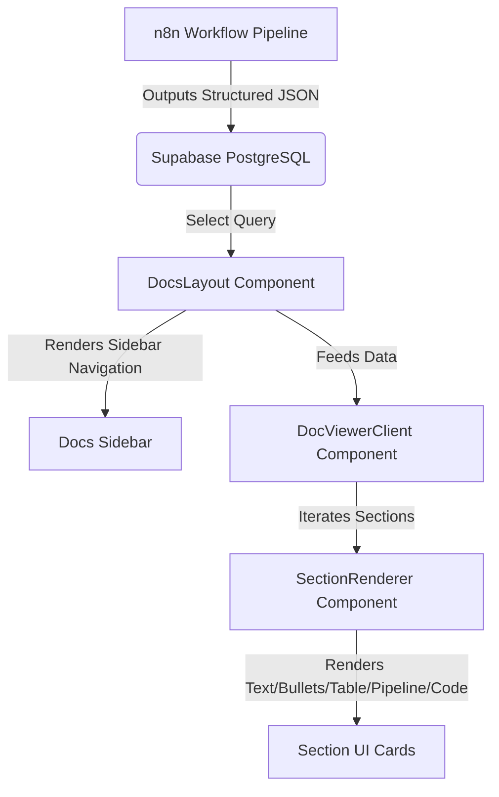

# System Architecture - Cobebyte Sol. AI Docs

This document outlines the technical design, data schema models, and rendering pipelines of the AI Documentation Portal.

## Technical Architecture

### 1. Document Normalization Pipeline
To handle both raw database rows and static mock data registers identically, document data runs through `normalizeDoc(raw)` in `src/lib/normalizer.ts`. This ensures:
- Fallbacks are provided for missing fields.
- Section data conforms to the TypeScript and Zod schema validations.
- Rich-text or structural payloads match type expectations.

### 2. Markdown Rendering & Nesting Hierarchy
The custom markdown block parser (`parseMarkdownBlocks` in `src/lib/markdown.tsx`) handles nested layout structures based on subheading levels:
- **Heading 2 (`## `)**: Stays left-aligned (`ml-0`, `text-lg font-bold`), representing major subsections.
- **Heading 3 (`### `)**: Indented by `ml-4` (`text-base font-bold`), representing nested details.
- **Heading 4 (`#### `)**: Indented by `ml-8` (`text-sm font-semibold`), representing sub-steps.
- **Content Blocks (Paragraphs, lists, callouts)**: Inherit the indentation of their parent subheading (`ml-4`, `ml-8`, etc.) for clean layout nesting.

### 3. Autocomplete Search Component
The interactive search bar in `src/app/docs/layout.tsx` is built as an autocomplete spotlight input:
- Searches across both document titles and internal section headers in real time.
- Uses `React.useMemo` to cache the unified document directory reference, preventing Next.js re-render cascades.
- Renders an absolute overlay popup with backdrop dismissal handling.
