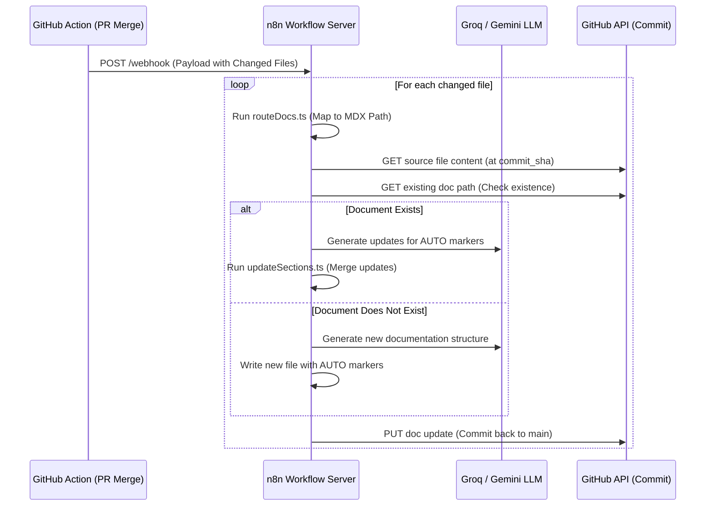

# AI Documentation Pipeline - n8n Integration Guide

This guide documents the design, payload schemas, and node actions for building the n8n automation server workflow that hooks into GitHub Actions.

---

## 1. End-to-End Flow Diagram



---

## 2. GitHub Webhook Payload Schema

The GitHub Actions workflow sends a JSON payload to the n8n webhook on a successful pull request merge.

```json
{
  "repo": "owner/repo",
  "branch": "main",
  "commit_sha": "abc123xyz456",
  "pr_number": 42,
  "changed_files": [
    "src/components/Button.tsx",
    "src/hooks/useAuth.ts"
  ]
}
```

---

## 3. Recommended n8n Workflow Architecture

### Node 1: Webhook Trigger (POST `/webhook/github-merge`)
- **Action**: Receives the GitHub merge payload.
- **Output**: JSON containing the list of modified source files.

### Node 2: Loop / Split in Batches
- **Action**: Processes each file in `changed_files` individually.

### Node 3: Execute Command (Route & Check)
- Runs `npx tsx scripts/routeDocs.ts` or parses `docs-config/routing.yaml` inline.
- Resolves the target MDX path.

### Node 4: Get Source Code (HTTP Request)
- **Method**: `GET`
- **URL**: `https://api.github.com/repos/{{$json.repo}}/contents/{{$json.current_file}}?ref={{$json.commit_sha}}`
- **Headers**:
  - `Authorization: token {{ $secrets.GITHUB_TOKEN }}`
  - `Accept: application/vnd.github.v3.raw`

### Node 5: Get Existing Doc (HTTP Request - Optional Fail Allowed)
- Checks if target MDX file exists.
- **Method**: `GET`
- **URL**: `https://api.github.com/repos/{{$json.repo}}/contents/{{$json.target_doc_path}}?ref={{$json.branch}}`

### Node 6: LLM Prompts (Structured Completion)

#### Mode A: Document Exists (Incremental Update)
Pass the source code and existing MDX content. Instruct the LLM to output ONLY the content to replace inside specific AI-controlled markers.
```text
System: You are an expert technical writer.
Task: Analyze the updated source code and the existing documentation.
Generate the documentation for the following sections:
- PROPS: Markdown table of component properties, types, default values.
- EXAMPLES: Practical usage code snippets of the component.

Output your response in raw JSON containing:
{
  "PROPS": "...",
  "EXAMPLES": "..."
}
Do not write markdown comments or explanation. Output only the requested JSON.
```

#### Mode B: Document Does Not Exist (Full Document Creation)
```text
System: You are an expert technical writer.
Generate a complete MDX documentation file for the provided source file.
Ensure you wrap generated sections inside these exact markers:

<!-- AUTO-PROPS-START -->
[Properties documentation here]
<!-- AUTO-PROPS-END -->

<!-- AUTO-EXAMPLES-START -->
[Examples here]
<!-- AUTO-EXAMPLES-END -->

You can also write introductory paragraphs and architecture notes outside these markers.
```

### Node 7: Execute Command (Update File Content)
- Run our typescript tool to overwrite the AI sections safely:
  `npx tsx scripts/updateSections.ts --file {dest} --marker PROPS --content {newPropsContent}`

### Node 8: Push Update to GitHub (HTTP Request)
- **Method**: `PUT`
- **URL**: `https://api.github.com/repos/{{$json.repo}}/contents/{{$json.target_doc_path}}`
- **Payload**:
  ```json
  {
    "message": "docs: incremental AI-update for {filename} [PR #{pr_number}]",
    "content": "{base64_encoded_mdx_content}",
    "sha": "{existing_file_sha_if_updating}",
    "branch": "{branch}"
  }
  ```

---

## 4. Best Practices for n8n Pipeline
1. **GitHub Secrets**: Save GitHub Access Token in n8n Credential Manager to prevent leaking private repository keys.
2. **Rate Limiting**: Add a 1-second delay between loop iterations to avoid GitHub API rate limits.
3. **Commit Messages**: Use clean, structured commit titles (e.g., `docs(ai): incremental update`) so developers can easily identify auto-generated updates.
